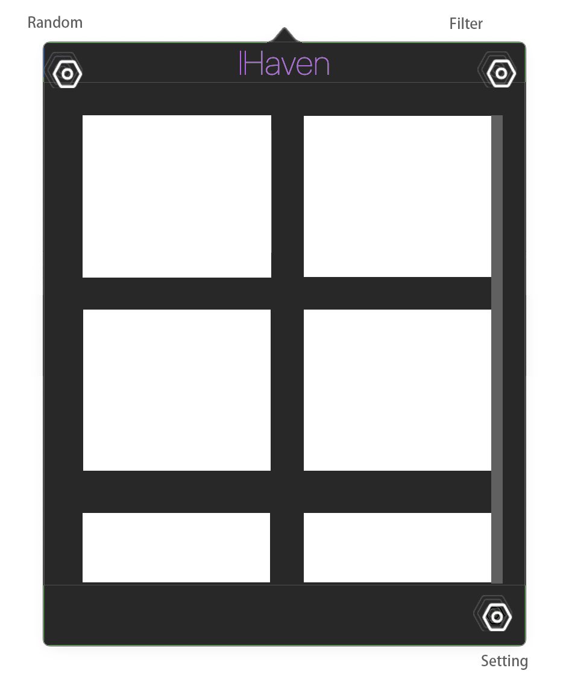
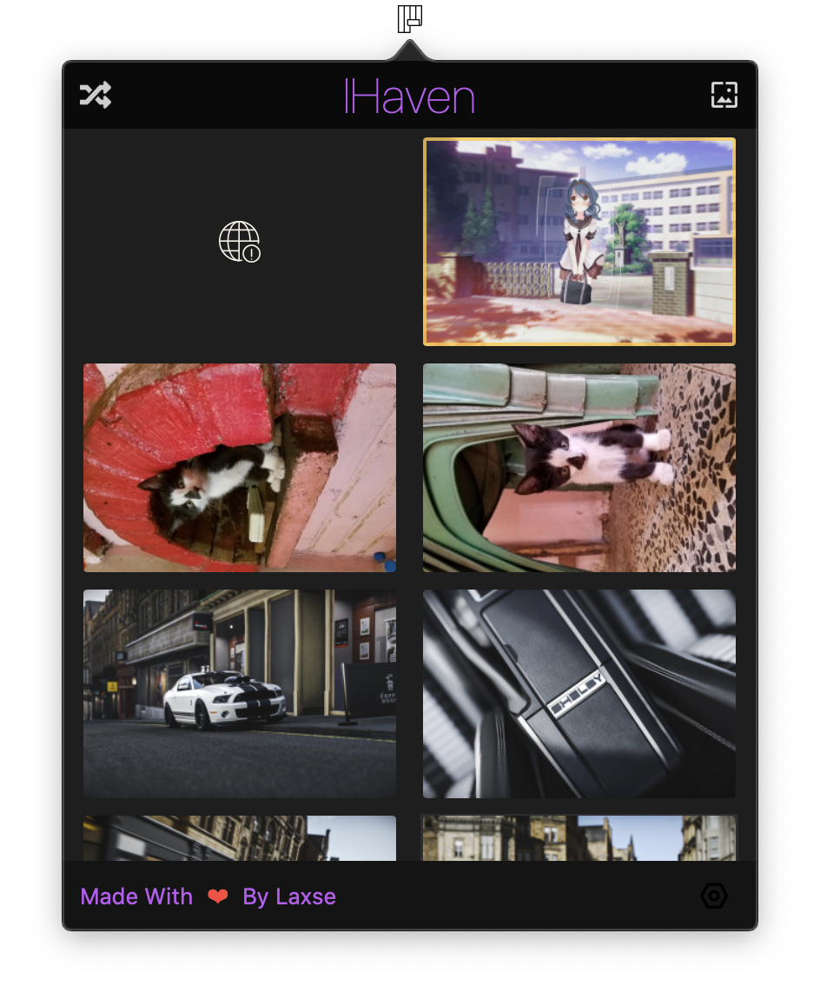

# Image[TODO]

<h1 align="center">IHaven</h1>
<h4 align="center">🍭Awesome Wallpaper App Based on SwiftUI Power By Wallhaven aimed to macOS</h4>
Visit website （url）[TODO] or （release）download [TODO]. f^_^;

# Features in the future
* Api from wallhacen.cc
* Random Image
* Full Filter
* Live Wallpapers Editor
* Bookmark
* Infinite scroll
* Change wallpaper regularly
* Localization

# Screenshots

# Todo
* [ ] ...
* [ ] ...

# Localization
Ihaven will auto detect your system language and use the localization.

You can set language manually in the Settings window.

Now the app support $\color{red}{nothing}$ 😰

# License
IHaven itself is licensed under the ** MIT License** license.
# Help
The author only recently learned swift,some code are not well or has error,please be patient。if you want to help me become better，just do it.
