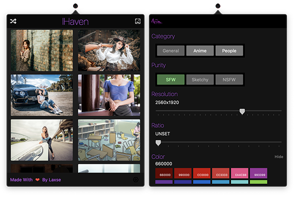
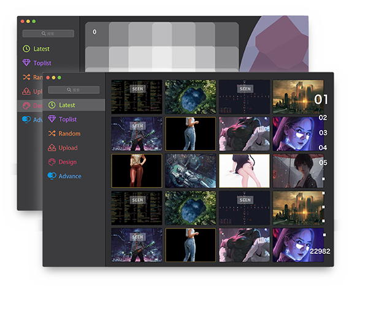

<h1 align="center" style="font-size:36px" >IHaven</h1>
<h4 align="center" style="font-size:18px" >🍭Awesome Wallpaper App Based on SwiftUI Power By Wallhaven aimed to macOS</h4>

 

        
        
        
        
        

Visit website <a href="http://o-hohohohoho.com">IHaven</a> or （release to）download. f^_^;

# Features  
* Api from wallhacen.cc
* Customized query conditions
* Popover-style And Infinite-scroll
* Quick / Free Download
* More features comming soon ...
# Screenshots
 - v1

 - v2

# Future
* Image Description View
* Window Style Application
* Localization
* Dynastic Wallpaper Designer
* Image Toolkit

# Localization
Ihaven will auto detect your system language and use the localization.

You can set language manually in the Settings window.

Now the app support $\color{red}{nothing}$ 😰

# License
IHaven itself is licensed under the  MIT License  license.